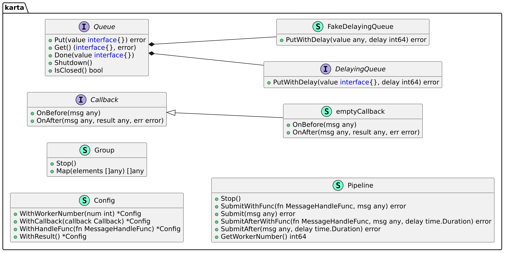

[English](./README.md) | 中文

<div align="center">
	
</div>

[](https://goreportcard.com/report/github.com/shengyanli1982/karta)
[](https://github.com/shengyanli1982/karta/actions)
[](https://pkg.go.dev/github.com/shengyanli1982/karta)

# 简介

`Karta` 组件是一个轻量级的任务批处理和异步处理模块，类似于 Python 中的 `ThreadPoolExecutor`。它提供了一个简单的接口来提交任务并获取结果。

为什么选择 `Karta`？在我的工作中，我经常需要处理大量的任务。我希望使用类似于 Python 中的 `ThreadPoolExecutor` 的代码来处理这些任务。然而，在 Golang 中并没有这样的组件可用，所以我决定自己创建一个。

`Karta` 的设计简单易用，由两个主要的组件组成：`Group` 和 `Pipeline`。

-   `Group`：使用 `Group` 组件进行任务的批处理。
-   `Pipeline`：使用 `Pipeline` 组件进行任务的顺序处理。每个任务可以指定一个处理函数。

# 优势

-   简单易用
-   轻量级，无外部依赖
-   支持自定义操作的回调函数

# 设计

根据设计，`Karta` 的架构 UML 图如下所示：



# 安装

```bash
go get github.com/shengyanli1982/karta
```

# 快速入门

`Karta` 非常易于使用。只需几行代码，您就可以高效地批量处理任务。

### 配置

`Karta` 库提供了一个配置对象，允许您自定义批处理的行为。配置对象提供以下方法进行配置：

-   `WithWorkerNumber`：设置工作线程的数量。默认值为 `1`，最大值为 `524280`。
-   `WithCallback`：设置回调函数。默认值为 `&emptyCallback{}`。
-   `WithHandleFunc`：设置处理函数。默认值为 `defaultMsgHandleFunc`。
-   `WithResult`：指定是否记录所有任务的结果。默认值为 `false`，仅适用于 `Group`。

### 组件

#### 1. Group

`Group` 是一个批处理组件，允许您按批处理任务。它使用固定数量的工作线程来处理任务。

**方法**

-   `Map`：通过提供对象的切片来按批处理任务，每个对象作为处理函数的参数。当 `WithResult` 设置为 `true` 时，该方法返回结果的切片。

**回调函数**

-   `OnBefore`：在任务处理之前执行的回调函数。
-   `OnAfter`：在任务处理之后执行的回调函数。

**示例**

```go
package main

import (
	"time"

	k "github.com/shengyanli1982/karta"
)

// handleFunc 是一个处理函数，它接收一个任意类型的消息，暂停一段时间（消息值的100毫秒），然后返回该消息和nil错误。
// handleFunc is a handler function that takes a message of any type, sleeps for a duration (100 milliseconds of the message value), and then returns the message and a nil error.
func handleFunc(msg any) (any, error) {
	// 将消息转换为整数，然后暂停该整数值的100毫秒。
	// Convert the message to an integer, then pause for 100 milliseconds of the integer value.
	time.Sleep(time.Duration(msg.(int)) * time.Millisecond * 100)

	// 返回接收到的消息和nil错误。
	// Return the received message and a nil error.
	return msg, nil
}

func main() {
	// 创建一个新的配置对象。
	// Create a new configuration object.
	c := k.NewConfig()
	// 设置处理函数，工作线程数量和结果处理。
	// Set the handler function, the number of worker threads, and result processing.
	c.WithHandleFunc(handleFunc).WithWorkerNumber(2).WithResult()

	// 使用配置创建一个新的工作组。
	// Create a new work group using the configuration.
	g := k.NewGroup(c)

	// 确保在main函数结束时停止工作组。
	// Ensure the work group is stopped when the main function ends.
	defer g.Stop()

	// 将处理函数映射到一组输入值。
	// Map the handler function to a set of input values.
	r0 := g.Map([]any{3, 5, 2})

	// 打印第一个结果的整数值。
	// Print the integer value of the first result.
	println(r0[0].(int))
}
```

**执行结果**

```bash
$ go run demo.go
3
```

#### 2. Pipeline

`Pipeline` 是一个任务处理组件，可以逐个处理任务。它根据任务的可用性动态调整工作线程的数量。

空闲的工作线程会在 `defaultWorkerIdleTimeout`（10 秒）后自动关闭。如果长时间没有任务，工作线程的数量将减少到 `defaultMinWorkerNum`（1）。

当使用 `Submit` 或 `SubmitWithFunc` 提交任务时，它会由一个空闲的工作线程处理。如果没有空闲的工作线程，将创建一个新的工作线程。如果运行中的工作线程不足，运行中的工作线程数量将增加到 `WithWorkerNumber` 方法设置的值。

`Pipeline` 需要一个实现了 `DelayingQueue` 接口的队列对象来存储任务。

```go
// Queue 接口定义了一个队列应该具备的基本操作。
// The Queue interface defines the basic operations that a queue should have.
type Queue = interface {
	// Put 方法用于将元素放入队列。
	// The Put method is used to put an element into the queue.
	Put(value interface{}) error

	// Get 方法用于从队列中获取元素。
	// The Get method is used to get an element from the queue.
	Get() (value interface{}, err error)

	// Done 方法用于标记元素处理完成。
	// The Done method is used to mark the element as done.
	Done(value interface{})

	// Shutdown 方法用于关闭队列。
	// The Shutdown method is used to shut down the queue.
	Shutdown()

	// IsClosed 方法用于检查队列是否已关闭。
	// The IsClosed method is used to check if the queue is closed.
	IsClosed() bool
}

// DelayingQueue 接口继承了 Queue 接口，并添加了一个 PutWithDelay 方法，用于将元素延迟放入队列。
// The DelayingQueue interface inherits from the Queue interface and adds a PutWithDelay method to put an element into the queue with delay.
type DelayingQueue = interface {
	Queue

	// PutWithDelay 方法用于将元素延迟放入队列。
	// The PutWithDelay method is used to put an element into the queue with delay.
	PutWithDelay(value interface{}, delay int64) error
}
```

**方法**

-   `SubmitWithFunc`: 使用处理函数提交任务。`msg` 是处理函数的参数。如果 `fn` 为 `nil`，将使用 `WithHandleFunc` 设置处理函数。
-   `Submit`: 提交没有处理函数的任务。`msg` 是处理函数的参数。处理函数将使用 `WithHandleFunc` 设置。
-   `SubmitAfterWithFunc`: 在延迟后使用处理函数提交任务。`msg` 是处理函数的参数。如果 `fn` 为 `nil`，将使用 `WithHandleFunc` 设置处理函数。`delay` 是延迟时间（`time.Duration`）。
-   `SubmitAfter`: 在延迟后提交没有处理函数的任务。`msg` 是处理函数的参数。处理函数将使用 `WithHandleFunc` 设置。`delay` 是延迟时间（`time.Duration`）。
-   `Stop`: 停止 Pipeline。

**回调函数**

-   `OnBefore`: 在任务处理之前执行的回调函数。
-   `OnAfter`: 在任务处理之后执行的回调函数。

**示例**

```go
package main

import (
	"fmt"
	"time"

	k "github.com/shengyanli1982/karta"
	wkq "github.com/shengyanli1982/workqueue/v2"
)

// handleFunc 是一个处理函数，它接收一个任意类型的消息，打印该消息，然后返回该消息和nil错误。
// handleFunc is a handler function that takes a message of any type, prints the message, and then returns the message and a nil error.
func handleFunc(msg any) (any, error) {
	// 打印接收到的消息。
	// Print the received message.
	fmt.Println("default:", msg)

	// 返回接收到的消息和nil错误。
	// Return the received message and a nil error.
	return msg, nil
}

func main() {
	// 创建一个新的配置对象。
	// Create a new configuration object.
	c := k.NewConfig()

	// 设置处理函数和工作线程数量。
	// Set the handler function and the number of worker threads.
	c.WithHandleFunc(handleFunc).WithWorkerNumber(2)

	// 创建一个新的假延迟队列。
	// Create a new fake delaying queue.
	queue := k.NewFakeDelayingQueue(wkq.NewQueue(nil))

	// 使用队列和配置创建一个新的管道。
	// Create a new pipeline using the queue and configuration.
	pl := k.NewPipeline(queue, c)

	// 确保在main函数结束时停止管道。
	// Ensure the pipeline is stopped when the main function ends.
	defer pl.Stop()

	// 提交一个消息到管道。
	// Submit a message to the pipeline.
	_ = pl.Submit("foo")

	// 使用特定的处理函数提交一个消息到管道。
	// Submit a message to the pipeline using a specific handler function.
	_ = pl.SubmitWithFunc(func(msg any) (any, error) {
		// 打印接收到的消息。
		// Print the received message.
		fmt.Println("SpecFunc:", msg)

		// 返回接收到的消息和nil错误。
		// Return the received message and a nil error.
		return msg, nil
	}, "bar")

	// 暂停一秒钟。
	// Pause for one second.
	time.Sleep(time.Second)
}
```

**执行结果**

```bash
$ go run demo.go
default: foo
SpecFunc: bar
```
